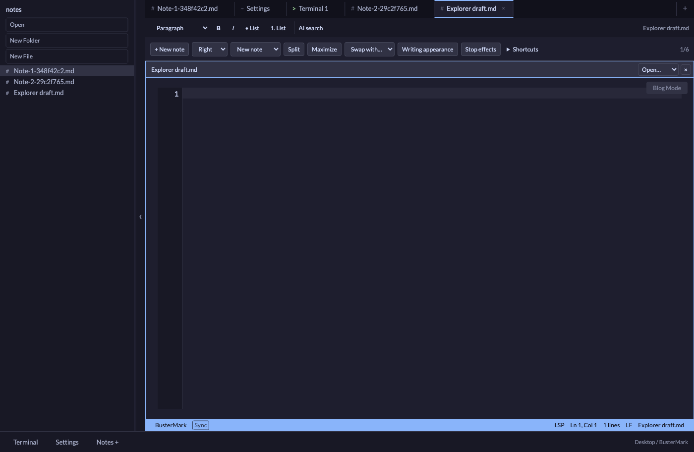

# Sidebar, footer navigation, and Desktop notes home

- [x] **COMPLETED** — Remove Explorer pop-out actions, the In/Out header controls,
  and the Explorer panel type. Retired Explorer session tabs no longer reopen.
- [x] **COMPLETED** — Add an always-reachable bumper at the sidebar's right edge.
  Cmd+B toggles the same sidebar, including while an input has focus. The separate
  resize handle remains available.
- [x] **COMPLETED** — Add a footer with Terminal, Settings, and Notes. Terminal
  and Settings reuse an existing tool tab; Notes creates a new Markdown file.
- [x] **COMPLETED** — Provision a persistent app-data `Notes` folder and a Desktop
  symbolic link named `BusterMark`. Preserve colliding folders and unrelated links;
  choose a numbered name and reuse it on subsequent launches.
- [x] **COMPLETED** — Make new app notes real `.md` files with automatic saving.
  Wait for file creation before saving typed content. Keep drafts and report errors
  if creation or saving fails. App-side rename/move updates open file paths; delete
  retains an open draft for Save As. Saving an existing managed note cannot silently
  recreate an externally deleted file.
- [x] **COMPLETED** — Open Notes home on initial setup, refresh the tree on return
  from Finder, and return to Notes when closing another folder. Preserve existing
  open writing buffers rather than discarding them when closing a folder.

The footer shows the actual Desktop link. If shortcut creation is denied, the
underlying Notes folder remains usable and the error includes its real location.
Existing external files are not copied into Notes. Previously untitled drafts
retain their recovery data and can still be saved with Save As.

## Verification

- TypeScript: `bunx tsc --noEmit` passed.
- Frontend suite: **468 tests in 42 files passed**, including delayed creation
  followed by saving live text, creation failure recovery, save/rename races,
  managed path boundaries, and retiring old Explorer session tabs.
- Rust suite: **91 tests passed**. Real temporary-directory tests verify a true
  symlink, nested files visible in both directions, reuse on repeated setup, and
  preserving an existing Desktop folder and an unrelated broken link.
- Final unsigned macOS debug app build passed.
- [Browser checks](assets/layout-notes-browser-results.json): **27 assertions
  passed with no uncaught runtime exceptions** using the real App/Provider and
  an isolated mocked Tauri backend. Verified bumper/accessibility, Cmd+B from the
  editor and terminal without terminal input, tool-tab reuse, Notes creation,
  typed-content autosave, extensionless Explorer file creation, and closing an
  external folder while retaining drafts. The browser check exposed and verified
  a fix for Enter/unmount triggering the creation field's blur handler twice.
- Browser fixtures and owned test processes were removed after verification;
  the user's dev server was left running. Filesystem/symlink claims above come
  from the real Rust temporary-directory tests, not the browser mocks.

## Next

Continue [Phase 3](../phases/phase-3.md): Claude/Codex connection UI and app commands.
