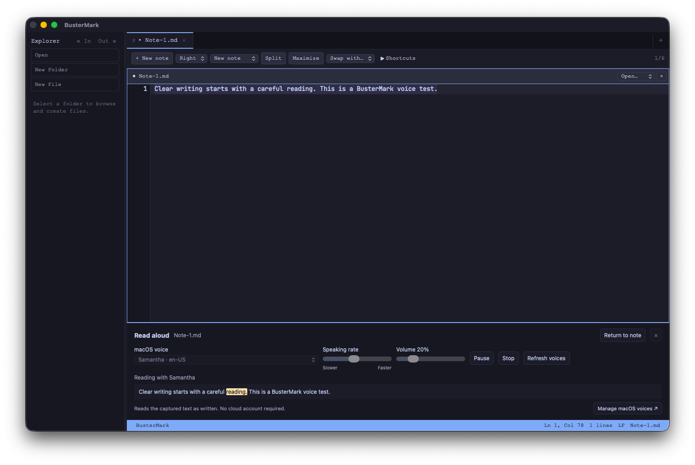

# Phase 1 — macOS voices and selected-text reading

Status: **COMPLETED** for this increment. Whole-document reading, audio export,
speech model discovery, and the remaining Phase 1 checklist are still open.

Session: **PAUSED at user request** after this verified increment. Resume with
paragraph/from-cursor/whole-document reading and bounded playback chunks, followed
by audio export. See the [session checkpoint](2026-09-20-phase-1.md).

## Delivered

- [x] **COMPLETED** — Voice in the selection toolbar opens a persistent playback
  strip without starting audio. Choose an installed macOS voice and Read selection.
  The strip stays available while switching panes or editing a note.
- [x] **COMPLETED** — Voice identifiers, names, languages, and native quality
  metadata come from AVSpeechSynthesizer. Rate and volume are adjustable before
  playback. Last-used options are retained locally; passages and jobs are not.
- [x] **COMPLETED** — Pause, resume, stop, and natural completion use native
  callbacks. Starting is distinct from speaking. Stop works during startup, and
  old callbacks cannot resume a stopped or replaced job. Only one reading runs
  at a time; another reading requires stopping or finishing the current one.
- [x] **COMPLETED** — A frozen selection and its revision/range are validated
  before asynchronous startup and again before the native request. Later edits
  never alter queued text. A changed/closed source suppresses progress highlighting
  and requires a fresh selection for a new reading. The editor is never modified.
- [x] **COMPLETED** — Native UTF-16 word ranges highlight the captured-text
  preview, independently of the editor selection. The preview follows progress
  without scrolling or moving the editor's caret. Invalid ranges and partial
  surrogate pairs are ignored.
- [x] **COMPLETED** — Missing voices require an explicit replacement. A link to
  Apple's voice-management guide and Refresh voices support macOS-managed downloads.
  There is no cloud fallback. Unsupported platforms report availability clearly.
- [x] **COMPLETED** — Eight shared commands bring the catalog to **39**:
  `selection voice`, `speech voices list`, `speech read`, `speech pause`,
  `speech resume`, `speech stop`, `speech status`, and `speech source`.

The native implementation uses a small Objective-C ARC bridge behind Rust/Tauri
commands, keeping AVSpeechSynthesizer and delegate ownership on the main thread.
Each job owns a synthesizer; shutdown stops playback. A startup timeout reports
missing/unresponsive voice assets instead of leaving controls indefinitely starting.

## Verification

- TypeScript and whitespace checks passed.
- Frontend suite: **364 tests in 34 files passed**, including 21 speech lifecycle
  tests covering startup cancellation, failed startup, terminal events, stale
  sources, UTF-16 progress, missing voices, cleanup failures, and request retries.
- Native library suite: **89 tests passed**.
- The repeatable native probe in `src-tauri/tests/speech_probe.m` passed voice
  enumeration, Unicode progress, pause/resume, stop, stale-ID rejection, restart,
  and natural completion. It reported **180 voices** on Intel macOS 26.6.2 and
  completed a short Samantha reading at 20% volume. This verifies callbacks/output
  operation, not a subjective listening-quality judgment.
- The bridge compiles with a macOS 10.15 deployment target. Runtime checks on
  macOS 10.15 and Apple Silicon remain outstanding; compile compatibility does
  not establish that entire support matrix.
- Isolated desktop build and interaction check passed: created a disposable note,
  opened Voice from its selection, chose Samantha, and read at 20% volume. The
  playback strip reported reading, displayed word progress, and preserved the
  source note and selection. The screenshot below records the running playback.
- The isolated test app was stopped after verification. The normal debug bundle
  is rebuilt with the original identifier; the user's regular profile was not
  used for the smoke test.

## Remaining scope

This increment reads selected text as written, up to 32 KiB UTF-8. It does not
strip Markdown, synthesize whole documents in chunks, export audio, provide
previous/next passage navigation, or map speech overlays into the source editor.
Reusable presets, automatic voice refresh after returning from System Settings,
offline/support-matrix verification, Personal Voice, and non-Apple engines remain
open checklist items. A restarted app does not resume old audio automatically.

References:
[AVSpeechSynthesizer](https://developer.apple.com/documentation/avfaudio/avspeechsynthesizer/),
[native spoken-range callback](https://developer.apple.com/documentation/avfaudio/avspeechsynthesizerdelegate/speechsynthesizer(_:willspeakrangeofspeechstring:utterance:)),
[Apple voice-management guide](https://support.apple.com/guide/mac-help/change-the-voice-your-mac-uses-to-speak-text-mchlp2290/mac).
