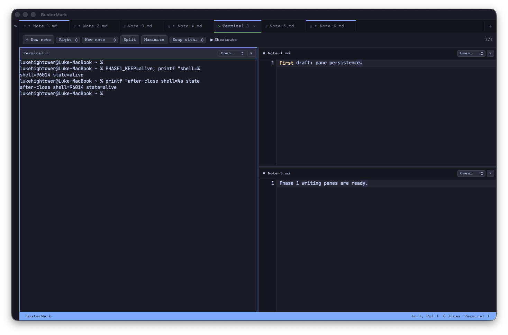
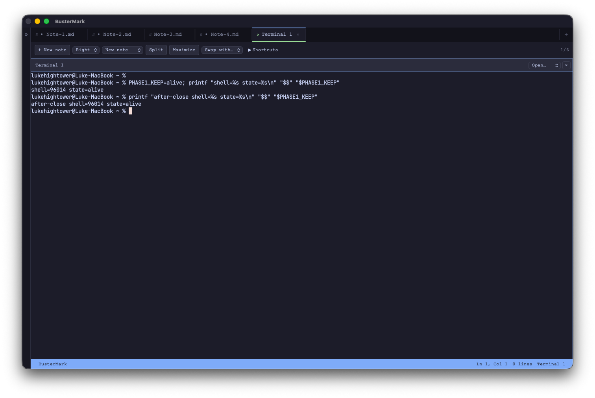
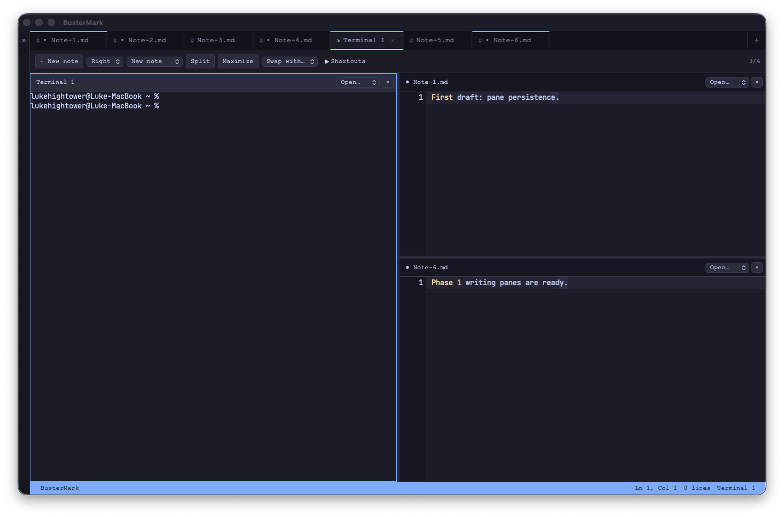

# Phase 1 — First writing-pane increment

September 20, 2026. [Phase checklist](../phases/phase-1.md).

## Session checkpoint — PAUSED at user request

Phase 1 is partially complete. Work is paused after completing macOS selected-text
reading; no further implementation is underway.

- **COMPLETED** — Writing panes, selection Copy/Paste, local dictionary lookup,
  reviewed AI edits, and macOS selected-text reading with voice choice, rate,
  volume, pause/resume/stop, and word progress. The shared catalog has **39 commands**.
- Latest verification: **364 frontend tests**, **89 native tests**, TypeScript,
  and the regular debug desktop build passed. Desktop speech playback with
  Samantha at 20% volume was verified while preserving the note and selection.
- The isolated speech test app was stopped. The regular debug bundle uses
  `com.lukehightower.buster`. This checkpoint did not create a commit or release.
- Resume with paragraph/from-cursor/whole-document reading, including bounded
  chunks and cancellation; then audio export. Voices & Models discovery and
  comparison remain later Phase 1 work.
- Keep open: synchronized duplicate note views, source-editor speech overlays,
  reusable reading presets, older-macOS/Apple Silicon runtime verification,
  live AI-provider verification, recovery follow-ups, and the Phase 0 fast-output
  terminal scrollback issue.

Latest detail: [selection actions](2026-09-20-selection-actions.md),
[lookup and AI review](2026-09-20-writing-review.md), and
[macOS speech and desktop evidence](2026-09-20-macos-speech.md).
The sections below preserve the earlier writing-pane increment's historical state;
use this checkpoint and the phase checklist for current progress.

## Delivered

- **COMPLETED** — Stable pane IDs and nested horizontal/vertical splits, up to six
  panes. New splits create Markdown notes by default; terminal and empty panes
  are available in the toolbar and internal command interface.
- **COMPLETED** — Pane headers, dirty markers, active-pane borders, spatial
  navigation, keyboard resizing, swap, and maximize/restore. The toolbar includes
  a shortcut guide and a route to binding customization.
- **COMPLETED** — Closing a pane retains its draft or terminal in the tab bar.
  Editors and terminals remain mounted during layout changes, preserving document
  state and shell processes. Closing a document/terminal tab remains separate.
- **COMPLETED** — The shared command catalog grows from 12 to 19 commands:
  `document create`, `panel split/close/zoom/swap/resize`, and `layout inspect`.
  Existing panel discovery/focus now includes stable pane IDs. AI retries do not
  create duplicate notes or splits.
- **COMPLETED** — Session snapshots now include pane structure, ratios, active/zoomed pane,
  document references, cursor/selection/scroll state, and draft backup references.
  Legacy sessions migrate to one pane. Invalid layouts preserve recovery data
  and pause automatic session saves.

## Verification

- `bunx tsc --noEmit` passed.
- Frontend tests: **305 passed across 26 files**. Coverage includes layout
  invariants, minimum sizes, migration/corruption, pane commands and retries,
  selection recovery, deferred focus, and shortcut routing.
- `cargo test -p bustermark --lib`: **75 passed**.
- Debug Tauri app packaging passed. Desktop checks used the isolated
  `com.lukehightower.bustermark.phase1smoke` identifier.
- Desktop checks confirmed new-note typing, nested splits, spatial focus,
  keyboard resize, maximize/restore, retained note selections, CLI pane swap,
  and closing/reopening a pane without losing its shell.
- The same shell PID (`96014`) and `PHASE1_KEEP=alive` survived layout changes and
  closing/reopening its pane. App restarts create new shells, as expected.
- Initial smoke testing found deferred editor focus returning typing to an old
  note. Focus requests now ignore superseded targets and recheck pane activity.
- Restart testing found WebKit selecting the first input while the saved terminal
  was spawning. Recovery now explicitly focuses the saved pane after mounting.
  The final restart passed: the next periodic snapshot matched the saved layout,
  active terminal pane, note references, and selections; unsaved drafts were
  visible in their restored panes.
- A cleared live selection no longer falls back to an old recovered selection
  during the next save; a regression test covers this.

## Remaining work

- Pointer divider handlers are implemented, but synthetic desktop drag attempts
  did not move a divider. Keyboard resizing and geometry constraints passed.
  Keep pointer verification open; do not treat it as a confirmed passing check.
- A note currently has one live view. Opening an already visible note focuses it;
  independent synchronized views remain unchecked in Phase 1.
- Selection action menu, reviewed AI edits, speech service, native Apple voices,
  Voices & Models, discovery, and audio export are subsequent increments.
- Periodic recovery retains the Phase 0 limitation: edits since the last snapshot
  can be lost on abrupt exit. Backup pruning and graceful shutdown remain follow-ups.
- The Phase 0 fast-output terminal scrollback issue remains open.

## Desktop evidence

