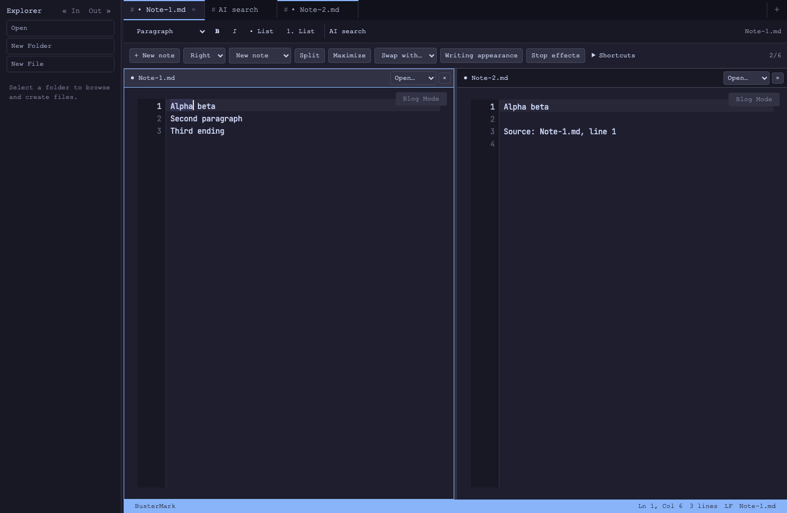

# Phase 2 — Writing interface, search, and appearance

Status: **COMPLETED — implemented features and automated/browser acceptance.**
Phase 1 remains paused. [Phase 3](../phases/phase-3.md) captures the requested
Claude/Codex connection UI and agent command loop; neither connection is claimed
as implemented by this phase.

## Completed

- **COMPLETED** — Markdown padding, centered/fill writing columns, responsive
  inset reduction, font size, and measured line spacing. Untitled Markdown and
  Save As use reactive file-type detection. Spacing never changes file text.
- **COMPLETED** — Shared heading, bold, italic, unordered-list, and ordered-list
  commands with an accessible toolbar. Captured source identity/range/revision,
  active/mixed states, clear unsupported-syntax errors, and one-step undo protect
  direct Markdown editing. Empty emphasis markers can be toggled back off.
- **COMPLETED** — Search portal for open notes, including unsaved text. Opening
  only offers selected text as an editable query; submission is explicit and
  local. Results can open a fresh match, retain a captured passage as a note, or
  open AI review without generating. Source tabs/engines survive pane-limit reuse.
- **COMPLETED** — App/workspace/pane appearance scopes, live preview/apply/cancel,
  reset/revert, and saved appearances. Persistent preference writes are atomic;
  stale revisions and missing targets reject changes. Layout-only preferences
  remain compatible. Pane overrides and previews are temporary.
- **COMPLETED** — Theme, paper, midnight, and sage page colors; contrast-protected
  focus dimming; existing cursor glow/vignette/grain; bounded typing pulse with
  intensity/duration and reduced-motion handling. Stop effects works across
  scopes. Quiet, Reading room, and Night focus are built-in appearances.
- **COMPLETED** — The shared catalog now exposes **66 commands**. Discovery,
  schemas, JSON examples, validation, stable targeting, and retry deduplication
  serve human command entry and future model tool calls alike.

Only implemented effects are advertised. Global editor font-family settings are
reused. Paragraph spacing, per-heading fonts, caret trails, and character entrance
animation remain optional future extensions rather than advertised capabilities.
The portal deliberately starts with local open notes; model/web search follows
the connection milestone.

## Geometry and integration fixes

A real inset DOM viewport gives canvas/GPU drawing, selection, pointer input,
IME textarea positioning, and overlays one origin. Font size and line spacing
also share measured geometry. Reflow preserves the visible logical passage and
intra-row offset without seeking an off-screen caret; shrink clamps scrolling.
GPU baselines and wide-character placement match the CPU text grid, and palette
changes invalidate cached glyph colors.

The browser/native checks prompted additional fixes:

- Opening AI review after the portal fills the sixth pane reuses the portal view
  while keeping both source and portal tabs.
- Search rejects a changed toolbar capture instead of silently taking a new range.
- Returning preview fields to their original values cancels the old preview;
  deleting a saved appearance selects a valid remaining preset.
- Printable characters use native textarea input rather than competing keydown
  insertion. Composition-owned keydowns are ignored, including the final-key
  ordering described by [MDN's IME guidance](https://developer.mozilla.org/en-US/docs/Web/API/Element/keydown_event#keydown_events_with_ime).
- Replacing selected text is isolated from immediately preceding/following typing
  in undo history. Composition and selection replacement have regression tests.
- Closing a cached editor deactivates it and releases the new motion subscription.
  The existing macOS workaround retaining WebGL roots is otherwise unchanged.

## Verification

- `bunx tsc --noEmit`: passed.
- Final `bun run tauri build --debug --bundles app --no-sign`: passed after
  removing diagnostics. The bundle retains `com.lukehightower.buster`; this is
  an unsigned debug package, not a signed release.
- Frontend suite: **463 tests in 40 files passed**.
- The first padding increment had 398 passing tests; the completed phase adds
  formatting, portal, effects/rendering, composition, and expanded appearance
  scope/preview/preset coverage.
- Real App/BusterProvider/components ran in isolated headless Chrome with a mocked
  Tauri backend. No mock context or bridge remains in production code.
- [Primary browser results](assets/phase-2-browser-results.json): mouse/keyboard
  formatting and undo; actual margins/640 px column; colors; preview cancellation;
  pointer mapping with 20 px font and 40 px line grid; unchanged source revision;
  portal selection/query/keep behavior.
- [Advanced browser results](assets/phase-2-browser-advanced.json): first/last-line
  access, distant scrolling, resize preserving logical passage/cursor/revision,
  native browser composition committing once, and portal/review at six panes.
- [Final browser results](assets/phase-2-browser-final.json): printable/Shift input,
  selection replacement and undo, composition followed by normal typing,
  heading/list controls, preview cancellation at baseline, and preset deletion.
  Across these three runs, **42 browser assertions passed**.
- Typing pulse was bounded to 16 requested animation frames in the measured
  browser run; Reduce Motion used two ordinary update frames without the pulse
  loop. These are frame-request counts, not a hardware performance benchmark.
- Packaged macOS debug builds launched with isolated test profiles; the native
  toolbar, padded note, and automatic selection menu were inspected.
- [Native macOS accent check](assets/phase-2-native-accent.json): Option-E then E
  commits exactly `é`, including WebKit's final keydown after composition ends.
  An earlier plain-`e` result came from an unfocused test window; explicitly
  bringing the isolated app to the foreground restored native composition.
  Temporary input tracing was removed from the production source afterward.

The browser backend was mocked, so this phase does not claim live cloud generation,
external agent tool calls, a new live audio regression run, or broad native CJK
input-method coverage. Existing speech/review tests remain in the passing suite.

## Typography follow-up

Typography follow-up: **COMPLETED** — Lato replaces Courier as the primary
interface font across DOM controls, canvas chrome, and the normal reading preview.
Regular, bold, and italic faces are bundled for offline use and loaded before
initial canvas measurements. Fixed-width editor/terminal settings remain separate.
TypeScript and the production frontend build pass.

## Next

Build the Claude/Codex connection UI and verify a supported connection for each.
Then connect the chosen assistant's tool calls to the shared service and exercise
live writing review, search, and appearance changes end to end. Details and
acceptance examples are in [Phase 3](../phases/phase-3.md).
