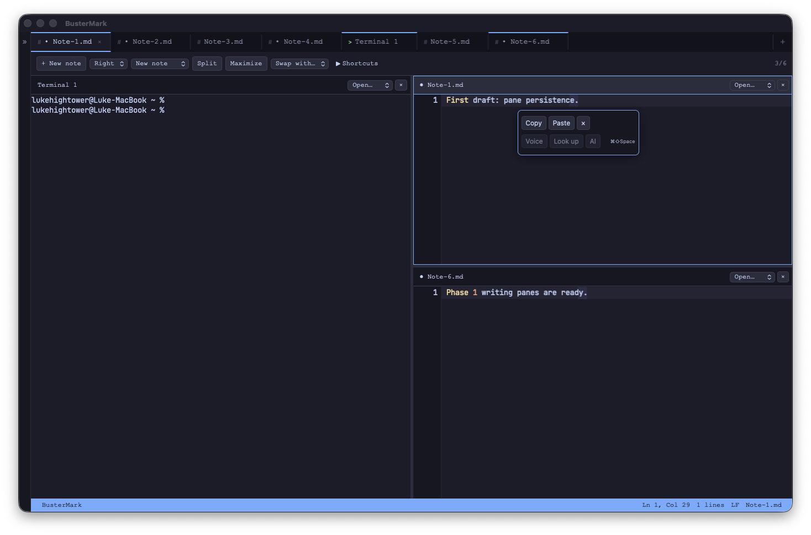
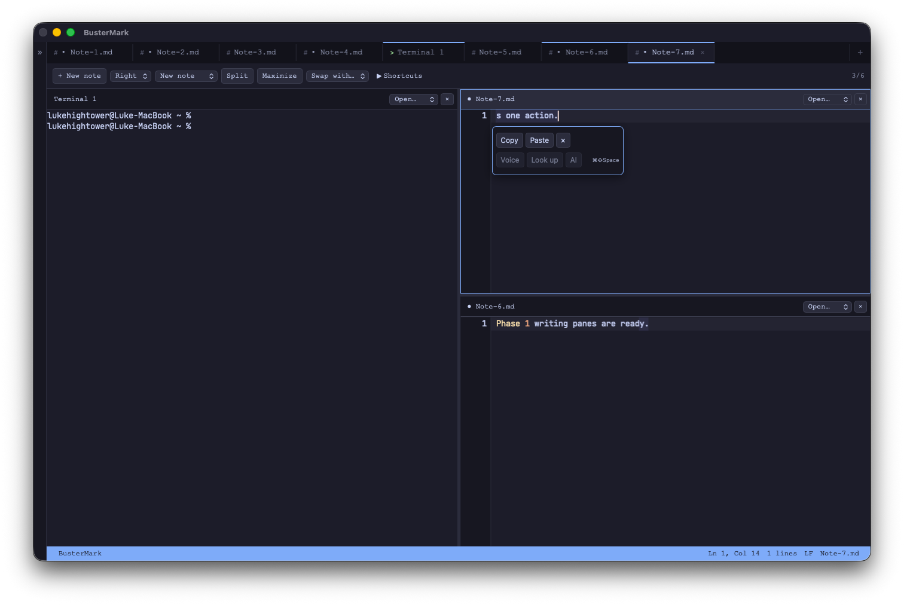
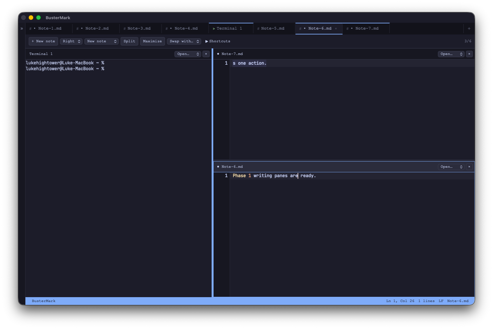
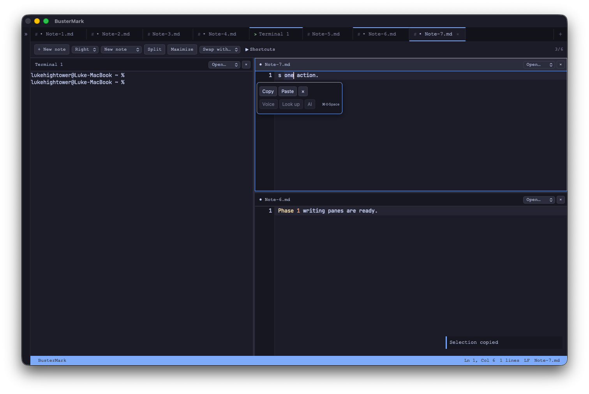

# Phase 1 — Selection actions

September 20, 2026. [Phase checklist](../phases/phase-1.md).

## Delivered

- **COMPLETED** — Nonempty note selections reveal a compact Copy/Paste toolbar
  after a 180 ms settling delay. Opening it does not move focus or access the
  clipboard. Voice, Look up, and AI are visibly unavailable until their adapters
  are implemented.
- **COMPLETED** — Escape dismisses the toolbar without clearing the selection;
  Command-Shift-Space reopens it and focuses the controls. Arrow keys navigate
  enabled actions. The toolbar uses the canvas's wrapped rows and text metrics
  and clamps within its pane; selections outside the visible canvas hide it.
- **COMPLETED** — `selection read/set/copy/paste` join the shared dispatcher,
  bringing the catalog to **23 commands**. Each action binds a pane, note,
  revision, selected range, and selected text. Delayed clipboard access rechecks
  the captured target before editing; focus changes cannot redirect the result.
- **COMPLETED** — Paste creates a separate undo group, normalizes clipboard line
  endings, places the caret after inserted text, and restores the original text
  and selection with one undo. Subsequent typing remains separate in history.
- **COMPLETED** — Native Undo/Redo menu items now reach the note engine. Native
  clipboard selectors remain available for dictation; ordinary input fields use
  their own DOM editing history.
- **COMPLETED** — Fixed continuous divider dragging by retaining divider DOM
  identities during layout updates and tracking mouse movement/release on the
  document. Window blur ends the drag and restores text selection behavior.
- **COMPLETED** — Added Unicode-aware double-click word selection, triple-click line selection,
  Shift-click selection extension, and document-level mouse-release cleanup.
  Right-click no longer collapses the source selection before its context menu.

## Verification

`bunx tsc --noEmit` passed. **317 frontend tests across 30 files** and **75 native
library tests** passed. Debug desktop app packaging passed.

Desktop checks used the isolated `com.lukehightower.bustermark.phase1smoke`
identifier. Verified automatic opening, Escape/reopen, keyboard action focus,
Copy retaining the source range, Paste replacing that range, and native Undo
restoring the passage and its selection. A continuous 120-pixel divider drag
resized the workspace without losing note content or terminal state.
Double-clicking a word opened the toolbar, and clicking its Copy button preserved
the selected word while reporting a successful system clipboard write.

Automated checks cover Unicode selection capture, copy/paste retry deduplication,
stale edits and changed selections during clipboard access, replaced panes,
focus changes, clipboard failures, empty clipboard text, multiple cursors,
atomic undo boundaries, native history routing, wrapped selection geometry,
offscreen ranges, and Unicode word boundaries.

## Still planned

Voice, lookup, reviewed AI replacements, speech progress, models, and audio export
remain unchecked. Full IME interaction and long-document selection coverage still
need desktop validation. This increment supports one primary selection; additional
cursors disable selection actions. The Phase 0 fast-output scrollback issue remains
open. Selection actions do not alter terminal selection behavior.

## Evidence

